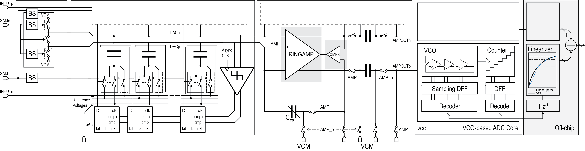
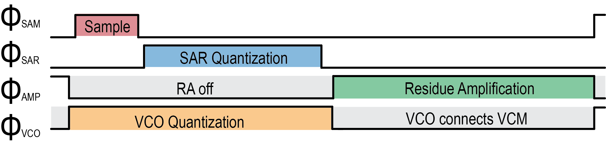
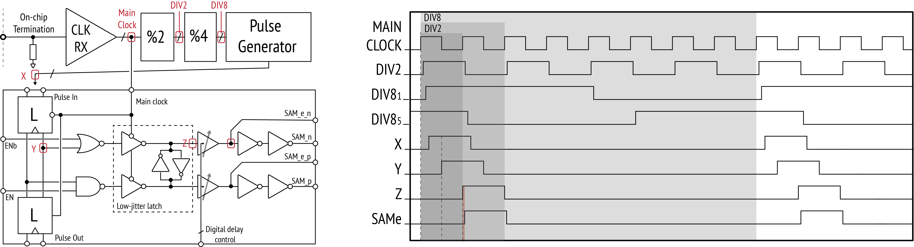

#  Time-interleaved SAR-VCO ADC generator

Author: Zhaokai Liu

This is a library for circuits for a time-interleaved SAR-VCO ADC generator.

## 📖 Architecture

## :bookmark_tabs: Generator Hierarchy
### 🔘Top-level: src/bag_sar_vco_adc/top
- Top-level single-channel ADC and time-interleaved array generation.
###  🔘AR ADC: src/bag_sar_vco_adc/sar
- `sar_async_clkgen`: Dynamic NAND gate-based asynchronous clock generator for asynchronous SAR.
- `sar_cdac`: Capacitive DAC, includes unit MFC capacitor, unit capacitor driver, different switching scheme
- `sar_comp/sar_comp_match`: Comparators with common-centroid layout implementation include building blocks such as pre-amplifier and dynamic latches, which can be used to build different comparator variants
- `sar_logic_gates/sar_logic`: Logic gates for SAR ADC logic, which are optimized for high-speed operation. SAR logic implements logic circuits for different switching schemes
- `sar`: SAR ADC top-level integration
### 🔘VCO-based ADC: src/bag_sar_vco_adc/vco
- `vco`: VCO-based ADC top-level generators: Counter + sampling flops + Counter decoder, RO + sampling flops + RO decoder, VCO-based ADC
- `vco_ring_osc`: Ring oscillator
- `vco_flops`: sampling flip-flops using double-tail comparator architecture
- `vco_counter_dec`: A high-speed asynchronous counter is used to capture VCO output overflow. Decoders for counter and RO
###  🔘Ring Amplifier: src/bag_sar_vco_adc/ra
- `ra`: Ring amplifier top
- `ra_ringamp`: Ring amplifier core
- `ra_sw`: Switches used for connecting RA in a closed loop
- `ra_cap`: Capacitors customized for ring amplifier, used for sampling, switched-capacitor gain tuning
- `ra_bias`: Biasing circuit for ring amplifier
### 🔘Sampler: src/bag_sar_vco_adc/sah
- `bootstrap`: Bootstrap sampler
- `sampler_top`: Top-level sampler circuit, implementing bootstrapped sampling circuit for both top- and bottom-plate switches inside the SAR ADC
- `sar_samp`: unit sampling switches embedded in the SAR CDAC, necessary for bottom plate sampling.
### 🔘Clocking circuit: src/bag_sar_vco_adc/clk
- `clk_rx`: Clock receiver, receives external clock on-chip
- `clk_global`: Global clocking circuit, buffers and phase divider
- `clk_local`: Local clock for generating different operation phases
- `clk_delay_tune`: Single-stage delay tuning, used for adjusting the critical sampling phase
- `clk_sync_sar`: Synchronous clock generator used in synchronous SAR implementation
### 🔘Reference generation: src/bag_sar_vco_adc/vref, src/bag_sar_vco_adc/rdac
- `amp`: Amplifier used in LDO
- `sf`: source follower
- `vref`: completed voltage reference generation
- `rdac`: resistor ladders for reference voltage generation
- `rdac_decoder`: Multiplexer array for R-ladder decoding
## :arrows_clockwise: Project dependencies:
- `bag3_testbenches` - base testbench library  :link: https://github.com/ucb-art/bag3_testbenches
- `bag3_analog` - resistors  :link: https://github.com/ucb-art/bag3_analog
- `bag3_digital` - logic cells (inverters, etc.)  :link:  https://github.com/ucb-art/bag3_digital
